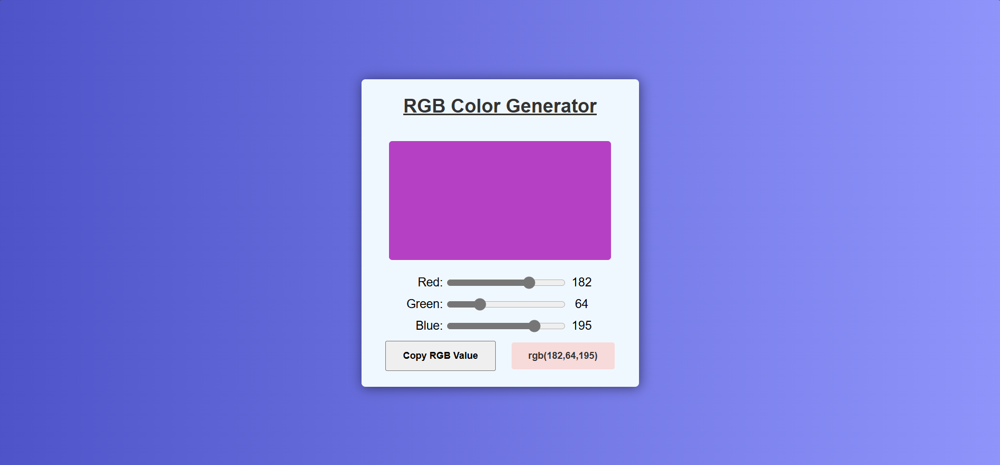

# RGB Color Generator

A simple web application that allows users to dynamically generate and display RGB colors by adjusting red, green, and blue values using sliders. Users can also copy the generated RGB value to the clipboard with a single click.

## Features

- Interactive sliders for adjusting red, green, and blue values.
- Real-time display of the generated color in a color box.
- Display of the current RGB values as numbers.
- Ability to copy the RGB value to the clipboard with a single click.

## Demo



## How It Works

The application provides three sliders (Red, Green, Blue) to adjust the RGB color values. As the sliders are adjusted, the corresponding color is shown in the color box. The current RGB values are displayed next to the sliders and updated in real time. There is also a button to copy the RGB value directly to the clipboard for easy use.

## How to Use

1. Clone the repository to your local machine.
    ```bash
    git clone https://github.com/your-username/rgb-color-generator.git
    ```
2. Navigate to the project directory.
    ```bash
    cd rgb-color-generator
    ```
3. Open the `index.html` file in your browser to view and use the application.
    ```bash
    open index.html
    ```

4. Adjust the sliders to modify the RGB values, and click the **Copy RGB Value** button to copy the generated RGB value.

## Project Structure

```plaintext
|-- index.html         # Main HTML file
|-- style.css          # CSS file for styling
|-- script.js          # JavaScript logic for generating RGB colors
